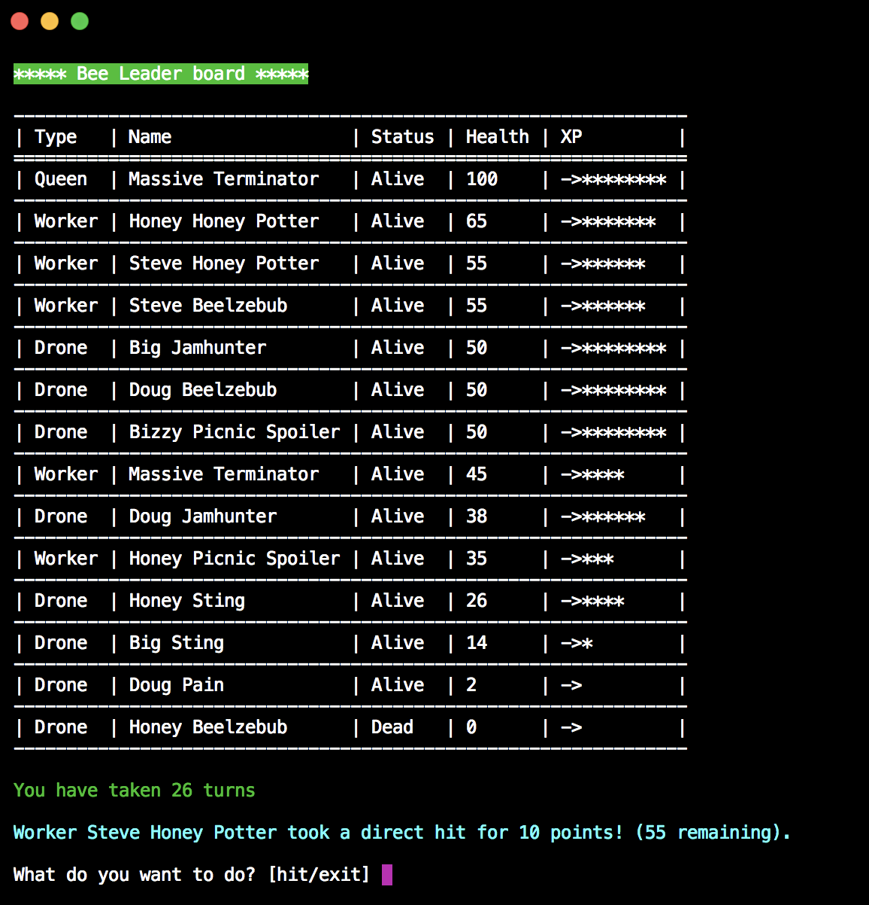

# Bees in the Hive
A simple command line single player game with bees, hives and stuff. Rules of the task can be found in the [Game Specifications](docs/Specification.md).

You should probably be playing something else, like SmashBros or something, and less to do with those picnic spoiling critters ;-)

**wait there's more**

The bees now have their own Hive leaderboard.

Wow, Fortnite - you have nothing on us....

## Setup
Install using composer:

    composer install
    
## Running
Run executable bash script:

    ./beesinthetrap.sh
## Run Tests

    vendor/bin/phpunit

... Now seriously, go and play something else a bit better xD.